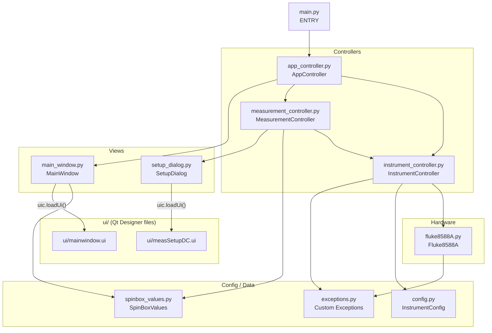
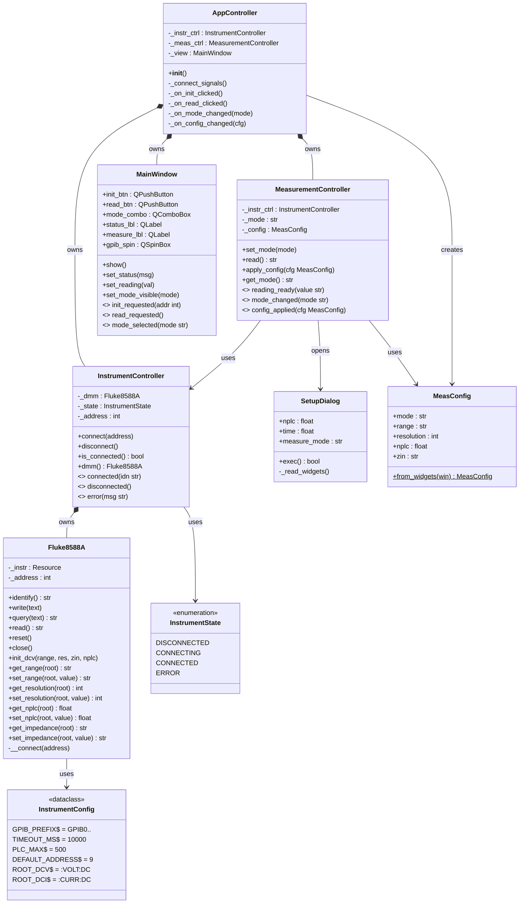

# Fluke8588A — Architecture Diagrams

## Module / File Structure

```mermaid
graph TD
    main["main.py\nENTRY"]

    subgraph controllers ["Controllers"]
        app_ctrl["app_controller.py\nAppController"]
        instr_ctrl["instrument_controller.py\nInstrumentController"]
        meas_ctrl["measurement_controller.py\nMeasurementController"]
    end

    subgraph views ["Views"]
        main_win["main_window.py\nMainWindow"]
        setup_dlg["setup_dialog.py\nSetupDialog"]
    end

    subgraph ui_files ["ui/  (Qt Designer files)"]
        mainwindow_ui["ui/mainwindow.ui"]
        meassetup_ui["ui/measSetupDC.ui"]
    end

    subgraph hardware ["Hardware"]
        fluke["fluke8588A.py\nFluke8588A"]
    end

    subgraph data ["Config / Data"]
        config["config.py\nInstrumentConfig"]
        sbv["spinbox_values.py\nSpinBoxValues"]
        exc["exceptions.py\nCustom Exceptions"]
    end

    main --> app_ctrl
    app_ctrl --> instr_ctrl
    app_ctrl --> meas_ctrl
    app_ctrl --> main_win
    instr_ctrl --> fluke
    instr_ctrl --> config
    meas_ctrl --> instr_ctrl
    meas_ctrl --> sbv
    meas_ctrl --> setup_dlg
    main_win --> sbv
    fluke --> exc
    instr_ctrl --> exc

    main_win -- "uic.loadUi()" --> mainwindow_ui
    setup_dlg -- "uic.loadUi()" --> meassetup_ui
```

---

## Class Diagram

```mermaid
classDiagram

    class Fluke8588A {
        -_instr : Resource
        -_address : int
        +identify() str
        +write(text)
        +query(text) str
        +read() str
        +reset()
        +close()
        +init_dcv(range, res, zin, nplc)
        +get_range(root) str
        +set_range(root, value) str
        +get_resolution(root) int
        +set_resolution(root, value) int
        +get_nplc(root) float
        +set_nplc(root, value) float
        +get_impedance(root) str
        +set_impedance(root, value) str
        -__connect(address)
    }

    class InstrumentController {
        -_dmm : Fluke8588A
        -_state : InstrumentState
        -_address : int
        +connect(address)
        +disconnect()
        +is_connected() bool
        +dmm() Fluke8588A
        <<signal>> connected(idn str)
        <<signal>> disconnected()
        <<signal>> error(msg str)
    }

    class MeasurementController {
        -_instr_ctrl : InstrumentController
        -_mode : str
        -_config : MeasConfig
        +set_mode(mode)
        +read() str
        +apply_config(cfg MeasConfig)
        +get_mode() str
        <<signal>> reading_ready(value str)
        <<signal>> mode_changed(mode str)
        <<signal>> config_applied(cfg MeasConfig)
    }

    class AppController {
        -_instr_ctrl : InstrumentController
        -_meas_ctrl : MeasurementController
        -_view : MainWindow
        +__init__()
        -_connect_signals()
        -_on_init_clicked()
        -_on_read_clicked()
        -_on_mode_changed(mode)
        -_on_config_changed(cfg)
    }

    class MainWindow {
        +init_btn : QPushButton
        +read_btn : QPushButton
        +mode_combo : QComboBox
        +status_lbl : QLabel
        +measure_lbl : QLabel
        +gpib_spin : QSpinBox
        +show()
        +set_status(msg)
        +set_reading(val)
        +set_mode_visible(mode)
        <<signal>> init_requested(addr int)
        <<signal>> read_requested()
        <<signal>> mode_selected(mode str)
    }

    class SetupDialog {
        +nplc : float
        +time : float
        +measure_mode : str
        +exec() bool
        -_read_widgets()
    }

    class MeasConfig {
        +mode : str
        +range : str
        +resolution : int
        +nplc : float
        +zin : str
        +from_widgets(win)$ MeasConfig
    }

    class InstrumentState {
        <<enumeration>>
        DISCONNECTED
        CONNECTING
        CONNECTED
        ERROR
    }

    class InstrumentConfig {
        <<dataclass>>
        GPIB_PREFIX$ = GPIB0..
        TIMEOUT_MS$ = 10000
        PLC_MAX$ = 500
        DEFAULT_ADDRESS$ = 9
        ROOT_DCV$ = :VOLT:DC
        ROOT_DCI$ = :CURR:DC
    }

    AppController *-- InstrumentController : owns
    AppController *-- MeasurementController : owns
    AppController *-- MainWindow : owns
    InstrumentController *-- Fluke8588A : owns
    InstrumentController --> InstrumentState : uses
    MeasurementController --> InstrumentController : uses
    MeasurementController --> MeasConfig : uses
    MeasurementController --> SetupDialog : opens
    AppController --> MeasConfig : creates
    Fluke8588A --> InstrumentConfig : uses
```